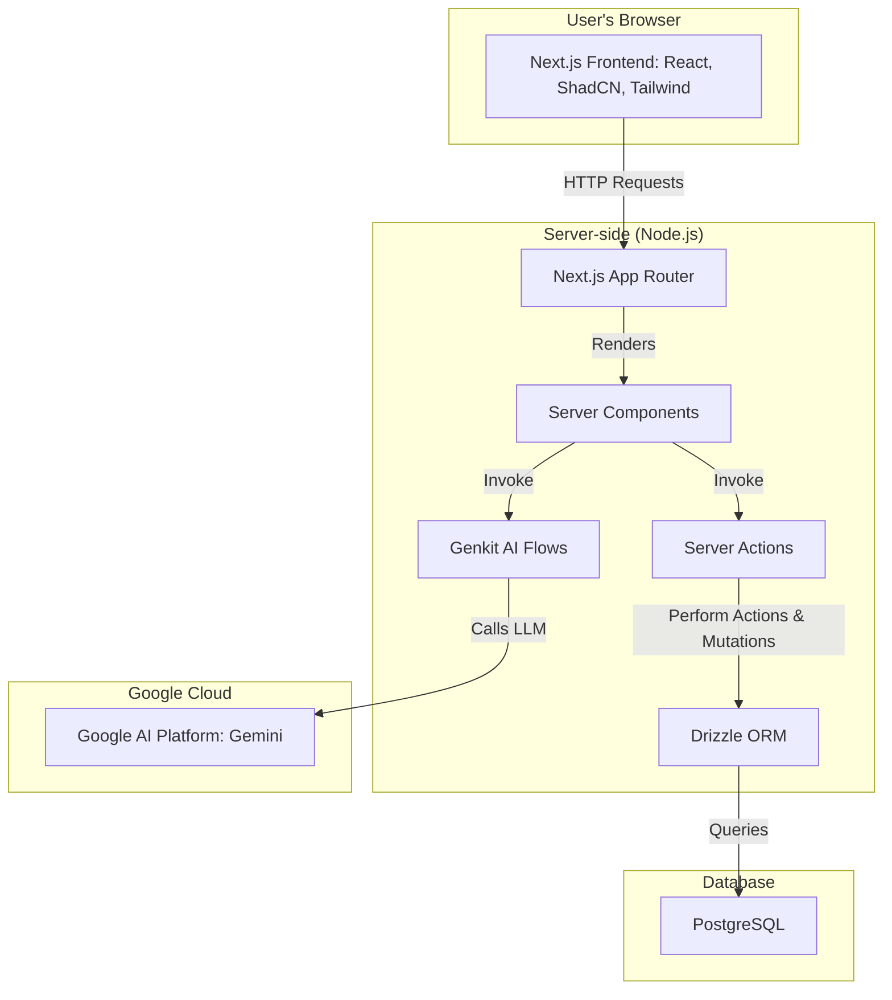
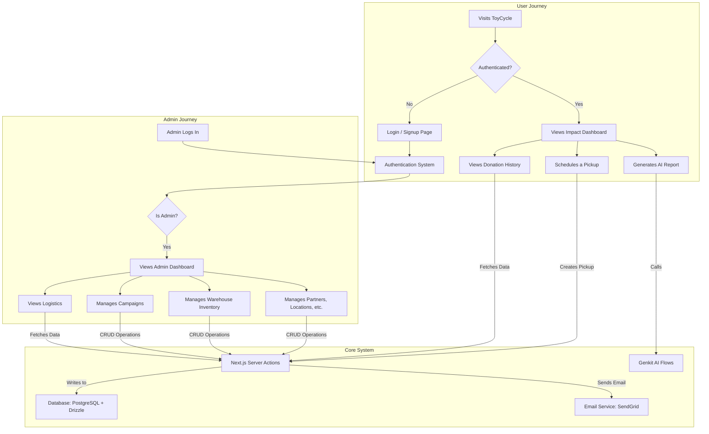

# ToyCycle - Turning Unused Toys into Smiles

This is a Next.js application built with Firebase Studio. ToyCycle is a platform designed to facilitate the donation and redistribution of children's toys, helping to reduce waste and bring joy to new families.

## Getting Started

Follow these instructions to get the project up and running on your local machine for development and testing purposes.

### Prerequisites

- Node.js (v18 or later)
- npm or yarn
- A PostgreSQL database

### Installation

1.  **Clone the repository:**
    ```bash
    git clone (https://github.com/gopalakrishnan-chakkaravarthy/toycycle
    cd toycycle
    ```

2.  **Install dependencies:**
    ```bash
    npm install
    ```

3.  **Set up environment variables:**
    Create a `.env.local` file in the root of your project and add the following variables. This file is ignored by Git and should not be committed.

    ```env
    # Your PostgreSQL database connection string
    POSTGRES_URL="postgresql://<user>:<password>@<host>:<port>/<database>"

    # Your SendGrid API Key for sending email notifications
    SENDGRID_API_KEY="YOUR_SENDGRID_API_KEY"
    SENDGRID_FROM_EMAIL="your-verified-sender@example.com"
    ```

### Database Setup

The project uses Drizzle ORM for database management.

1.  **Generate Migrations:**
    After making any changes to the database schema in `src/db/schema.ts`, you need to generate a new migration file.
    ```bash
    npm run db:generate
    ```

2.  **Run Migrations:**
    To apply the migrations and update your database schema, run:
    ```bash
    npm run db:migrate
    ```

3.  **Seed the Database:**
    To seed the database with initial data (like the admin user), run:
    ```bash
    npm run db:seed
    ```

### Running the Development Server

Once the setup is complete, you can start the development server:

```bash
npm run dev
```

The application will be available at `http://localhost:3000`.

## Architecture Diagram

This diagram outlines the technical architecture of the ToyCycle application.



## Functional Diagram

This diagram illustrates the primary user and admin workflows within the application.




## Features

### User-Facing Features
- **Authentication**: Secure login for users and administrators. Test users can be created on the fly, and an `admin@toycycle.com` user is available after seeding the database.
- **Impact Report Dashboard**: A home page that provides an at-a-glance view of the organization's impact, including total toys redistributed, smiles created, and environmental benefits.
- **AI-Powered Personalized Report**: Users can generate a unique, personalized impact summary of their contributions, powered by Google's Generative AI.
- **My Donations**: A dedicated page for users to view their donation history, including status, items, and estimated value.
- **Schedule a Pickup**: An interactive, calendar-based interface for scheduling toy pickups.
  - Select from available dates, with busy days highlighted.
  - View existing pickups for a selected date in a clean table format.
  - Schedule pickups from a custom address, a pre-defined Community Drop-off Point, or a Partner Organization.
  - Receive an automated email confirmation via SendGrid upon successful scheduling.
- **Community Drop-off Points**: A page listing all available locations where users can drop off their toy donations.
- **Our Partners**: A page showcasing the partner organizations that ToyCycle works with to redistribute toys.

### Admin-Only Features
- **Admin Dashboard**: A central hub for administrators to manage all core aspects of the application.
- **Full CRUD Operations**: Administrators have complete Create, Read, Update, and Delete capabilities for:
  - **Partners**: Manage schools, libraries, NGOs, and other partner organizations.
  - **Drop-off Locations**: Manage community drop-off points.
  - **Campaigns**: Create and manage social media campaigns with names, descriptions, and end dates.
  - **Accessory Types**: Manage categories for non-toy items like strollers and car seats.
  - **Toy Conditions**: Manage the different condition labels for toys (e.g., 'New', 'Gently Used').
- **Inventory Dashboard**: A specialized view for admins on the main dashboard page, showing key stats about the toy journey (collected, sanitizing, in warehouse, redistributed) and a bar chart visualizing donations by location.
- **Warehouse Management**: A comprehensive data table for managing individual inventory items, with filtering, sorting, and editing capabilities.
